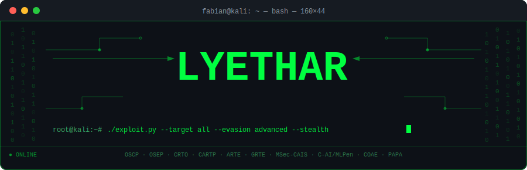
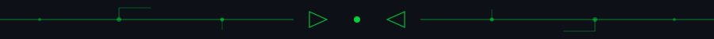
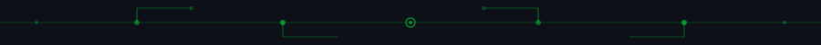
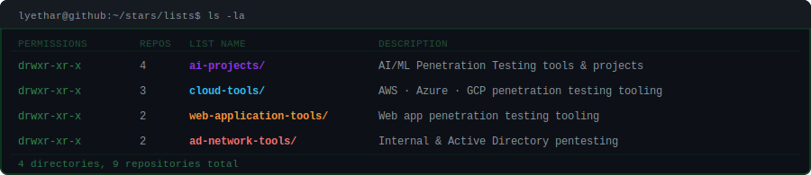
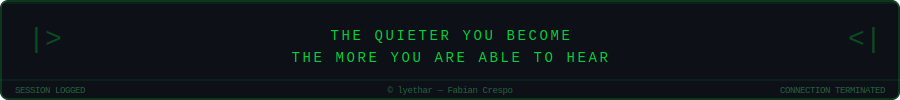

<!-- ═══════════════════════════════════════════════════════════════════════ -->
<!--                         HEADER BANNER                                   -->
<!-- ═══════════════════════════════════════════════════════════════════════ -->
<div align="center">



<br/>

[](https://lyethar.gitbook.io/methodology)

<br/>


&nbsp;
[](https://github.com/lyethar)

<br/>

[](https://lyethar.github.io/)
&nbsp;
[](https://lyethar.gitbook.io/methodology)
&nbsp;
[](https://hackerone.com/lyethar)
&nbsp;
[](https://bugcrowd.com/lyethar)
&nbsp;
[](https://linkedin.com/in/fabian-crespo)

</div>

<br/>

<!-- ═══════════════════════════════════════════════════════════════════════ -->
<!--                         CIRCUIT DIVIDER                                 -->
<!-- ═══════════════════════════════════════════════════════════════════════ -->


<br/>

<!-- ═══════════════════════════════════════════════════════════════════════ -->
<!--                            ABOUT                                        -->
<!-- ═══════════════════════════════════════════════════════════════════════ -->

## `$ whoami`

```bash
fabian@kali:~$ whoami
──────────────────────────────────────────────────────────────────────────
  Name    : Fabian Crespo (lyethar)
  Role    : Principal Penetration Tester @ Clearwater  [Oct 2022 – Present]
  Focus   : Offensive Security
──────────────────────────────────────────────────────────────────────────

fabian@kali:~$ cat about.txt
  Passionate red teamer with 4+ years of hands-on offensive security
  experience. Driven by an insatiable curiosity for hacking and a
  relentless commitment to continuous learning. Specializing in internal,
  external, assumed-breach, web application, AI-powered applications and cloud penetration tests
  across healthcare, finance, and technology sectors.

  Currently looking to push the frontier of AI/ML security — researching
  adversarial attacks, LLM jailbreaks, and novel prompt injection techniques.
```

<br/>

<!-- ═══════════════════════════════════════════════════════════════════════ -->
<!--                         CIRCUIT DIVIDER                                 -->
<!-- ═══════════════════════════════════════════════════════════════════════ -->


<br/>

<!-- ═══════════════════════════════════════════════════════════════════════ -->
<!--                        CERTIFICATIONS                                   -->
<!-- ═══════════════════════════════════════════════════════════════════════ -->

## `$ cat certifications.txt`

<div align="center">

<!-- Row 1 — Offensive Security -->

&nbsp;

&nbsp;


<br/><br/>

<!-- Row 2 — Cloud Red Team -->

&nbsp;

&nbsp;

&nbsp;


<br/><br/>

<!-- Row 3 — AI Security -->

&nbsp;

&nbsp;


</div>

<br/>

<!-- ═══════════════════════════════════════════════════════════════════════ -->
<!--                         CIRCUIT DIVIDER                                 -->
<!-- ═══════════════════════════════════════════════════════════════════════ -->


<br/>

<!-- ═══════════════════════════════════════════════════════════════════════ -->
<!--                          ARSENAL                                        -->
<!-- ═══════════════════════════════════════════════════════════════════════ -->

## `$ ls -la ./arsenal`

<div align="center">

### Languages & Scripting

[](https://python.org)
[](https://gnu.org/software/bash)
[](https://isocpp.org)
[](https://java.com)
[](https://microsoft.com/powershell)
[](https://kernel.org)
[](https://git-scm.com)
[](https://aws.amazon.com)
[](https://azure.microsoft.com)
[](https://cloud.google.com)

<br/>

### Offensive Security Tooling


&nbsp;

&nbsp;

&nbsp;

&nbsp;

&nbsp;


<br/><br/>

### Attack Domains


&nbsp;

&nbsp;

&nbsp;

&nbsp;

&nbsp;

&nbsp;

</div>

<br/>

<!-- ═══════════════════════════════════════════════════════════════════════ -->
<!--                         CIRCUIT DIVIDER                                 -->
<!-- ═══════════════════════════════════════════════════════════════════════ -->


<br/>

<!-- ═══════════════════════════════════════════════════════════════════════ -->
<!--                         MISSION LOG                                     -->
<!-- ═══════════════════════════════════════════════════════════════════════ -->

## `$ cat /var/log/mission_log.txt`

```
[2022-10 → PRESENT] PRINCIPAL PENETRATION TESTER — Clearwater
  ✓ Led 200+ engagements across healthcare, finance & technology sectors
  ✓ Internal · External · Assumed-Breach · Web App · AI/ML · Cloud penetration tests
  ✓ Uncovered high-impact vulnerabilities; delivered executive & technical reports
  ✓ Managed client expectations, timelines & full testing lifecycle
```

<br/>

<!-- ═══════════════════════════════════════════════════════════════════════ -->
<!--                         CIRCUIT DIVIDER                                 -->
<!-- ═══════════════════════════════════════════════════════════════════════ -->


<br/>

<!-- ═══════════════════════════════════════════════════════════════════════ -->
<!--                        REPOSITORY LISTS                                 -->
<!-- ═══════════════════════════════════════════════════════════════════════ -->

## `$ ls ~/github/lists`

<div align="center">



<br/><br/>

<table>
  <tr>
    <td align="center" width="25%">
      <a href="https://github.com/stars/lyethar/lists/ai-projects">
        
        <br/><sub><b>AI/ML Penetration Testing</b></sub>
      </a>
    </td>
    <td align="center" width="25%">
      <a href="https://github.com/stars/lyethar/lists/cloud-tools">
        
        <br/><sub><b>AWS · Azure · GCP Red Teaming</b></sub>
      </a>
    </td>
    <td align="center" width="25%">
      <a href="https://github.com/stars/lyethar/lists/web-application-tools">
        
        <br/><sub><b>Web Application Pentesting</b></sub>
      </a>
    </td>
    <td align="center" width="25%">
      <a href="https://github.com/stars/lyethar/lists/ad-network-tools">
        
        <br/><sub><b>Active Directory &amp; Network Pentesting</b></sub>
      </a>
    </td>
  </tr>
</table>

</div>

<br/>

<!-- ═══════════════════════════════════════════════════════════════════════ -->
<!--                         GITHUB STATS                                    -->
<!-- ═══════════════════════════════════════════════════════════════════════ -->

## `$ git log --all --graph --stat`

<div align="center">


&nbsp;


<br/><br/>


<br/><br/>


</div>

<br/>

<!-- ═══════════════════════════════════════════════════════════════════════ -->
<!--                         CIRCUIT DIVIDER                                 -->
<!-- ═══════════════════════════════════════════════════════════════════════ -->


<!-- ═══════════════════════════════════════════════════════════════════════ -->
<!--                            FOOTER                                       -->
<!-- ═══════════════════════════════════════════════════════════════════════ -->
<div align="center">



</div>
