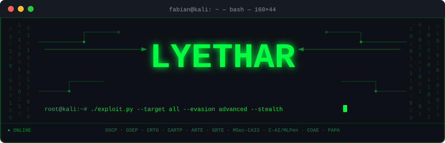
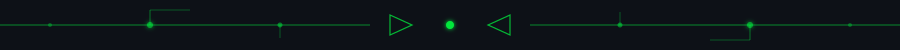
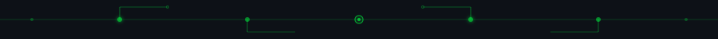
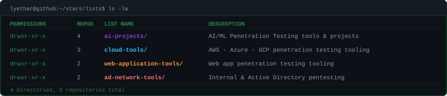
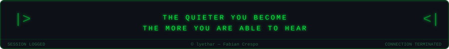

<!-- ═══════════════════════════════════════════════════════════════════════ -->
<!--                         HEADER BANNER                                   -->
<!-- ═══════════════════════════════════════════════════════════════════════ -->
<div align="center">



<br/>
<br/>


&nbsp;
[](https://github.com/lyethar)

<br/>

[](https://lyethar.github.io/)
&nbsp;
[](https://lyethar.gitbook.io/methodology)
&nbsp;
[](https://hackerone.com/lyethar)
&nbsp;
[](https://bugcrowd.com/lyethar)
&nbsp;
[](https://linkedin.com/in/fabian-crespo)

</div>

<br/>

<!-- ═══════════════════════════════════════════════════════════════════════ -->
<!--                         CIRCUIT DIVIDER                                 -->
<!-- ═══════════════════════════════════════════════════════════════════════ -->


<br/>

<!-- ═══════════════════════════════════════════════════════════════════════ -->
<!--                            ABOUT                                        -->
<!-- ═══════════════════════════════════════════════════════════════════════ -->

## `$ whoami`

```bash
fabian@kali:~$ whoami
──────────────────────────────────────────────────────────────────────────
  Name    : Fabian Crespo (lyethar)
  Role    : Principal Penetration Tester @ Clearwater  [Oct 2022 – Present]
  Focus   : Offensive Security
──────────────────────────────────────────────────────────────────────────

fabian@kali:~$ cat about.txt
  Passionate red teamer with 4+ years of hands-on offensive security
  experience. Driven by an insatiable curiosity for hacking and a
  relentless commitment to continuous learning. Specializing in internal,
  external, assumed-breach, web application, AI-powered applications and cloud penetration tests
  across healthcare, finance, and technology sectors.

  Currently looking to push the frontier of AI/ML security — researching
  adversarial attacks, LLM jailbreaks, and novel prompt injection techniques.
```

<br/>

<!-- ═══════════════════════════════════════════════════════════════════════ -->
<!--                         CIRCUIT DIVIDER                                 -->
<!-- ═══════════════════════════════════════════════════════════════════════ -->


<br/>

<!-- ═══════════════════════════════════════════════════════════════════════ -->
<!--                        CERTIFICATIONS                                   -->
<!-- ═══════════════════════════════════════════════════════════════════════ -->

## `$ cat certifications.txt`

<div align="center">

<!-- Row 1 — Offensive Security -->

&nbsp;

&nbsp;

&nbsp;

&nbsp;


<br/><br/>

<!-- Row 2 — Cloud Red Team -->

&nbsp;

&nbsp;

&nbsp;


<br/><br/>

<!-- Row 3 — AI Security -->

&nbsp;

&nbsp;

&nbsp;


<br/><br/>

<!-- Row 4 — Malware Dev & Evasion -->

&nbsp;


</div>

<br/>

<!-- ═══════════════════════════════════════════════════════════════════════ -->
<!--                         CIRCUIT DIVIDER                                 -->
<!-- ═══════════════════════════════════════════════════════════════════════ -->


<br/>

<!-- ═══════════════════════════════════════════════════════════════════════ -->
<!--                     VULNERABILITY RESEARCH                              -->
<!-- ═══════════════════════════════════════════════════════════════════════ -->

## `$ cat ~/research/disclosures.txt`

<div align="center">

<!-- Published GitHub Security Advisories — OpenEMR -->
[](https://github.com/openemr/openemr/security/advisories/GHSA-xwjf-6q28-9vj7)
&nbsp;
[](https://github.com/openemr/openemr/security/advisories/GHSA-rrw3-g25h-x68h)
&nbsp;
[](https://github.com/openemr/openemr/security/advisories/GHSA-rmmr-8498-463g)

</div>

<br/>

```bash
fabian@kali:~$ ./disclosure-timeline.sh --author lyethar
──────────────────────────────────────────────────────────────────────────
  [ PUBLISHED ]  OpenEMR — Electronic Medical Records Platform
  ────────────────────────────────────────────────────────────────────────
  GHSA-xwjf-6q28-9vj7   Stored XSS      →  unsanitized document note field
  GHSA-rrw3-g25h-x68h   IDOR            →  patient portal settings
  GHSA-rmmr-8498-463g   Reflected XSS   →  rich-text editor template param

  [ PENDING ]    Healthcare EMR Systems — coordinated disclosure
  ────────────────────────────────────────────────────────────────────────
  CWE-639   Authorization bypass via unsanitized API parameter
  CWE-862   Patient record disclosure without authorization
  CWE-918   SSRF in setup wizard                       [ CVSS 8.6 · HIGH ]
──────────────────────────────────────────────────────────────────────────
```

<br/>

<!-- ═══════════════════════════════════════════════════════════════════════ -->
<!--                         CIRCUIT DIVIDER                                 -->
<!-- ═══════════════════════════════════════════════════════════════════════ -->


<br/>

<!-- ═══════════════════════════════════════════════════════════════════════ -->
<!--                        REPOSITORY LISTS                                 -->
<!-- ═══════════════════════════════════════════════════════════════════════ -->

## `$ ls ~/github/lists`

<div align="center">



<br/><br/>

<table>
  <tr>
    <td align="center" width="25%">
      <a href="https://github.com/stars/lyethar/lists/ai-projects">
        
        <br/><sub><b>AI/ML Penetration Testing</b></sub>
      </a>
    </td>
    <td align="center" width="25%">
      <a href="https://github.com/stars/lyethar/lists/cloud-tools">
        
        <br/><sub><b>AWS · Azure · GCP Red Teaming</b></sub>
      </a>
    </td>
    <td align="center" width="25%">
      <a href="https://github.com/stars/lyethar/lists/web-application-tools">
        
        <br/><sub><b>Web Application Pentesting</b></sub>
      </a>
    </td>
    <td align="center" width="25%">
      <a href="https://github.com/stars/lyethar/lists/ad-network-tools">
        
        <br/><sub><b>Active Directory &amp; Network Pentesting</b></sub>
      </a>
    </td>
  </tr>
</table>

</div>

<br/>

<!-- ═══════════════════════════════════════════════════════════════════════ -->
<!--                        FEATURED TOOLING                                 -->
<!-- ═══════════════════════════════════════════════════════════════════════ -->

## `$ ls ~/arsenal/ --sort=recent`

<div align="center">

<table>
  <tr>
    <td width="50%" valign="top">
      <h4>🤖 &nbsp;AI / ML Security</h4>
      <a href="https://github.com/lyethar/HexProbe"><b>HexProbe</b></a><br/>
      <sub>Browser-based red-teaming workbench for LLM applications</sub><br/><br/>
      <a href="https://github.com/lyethar/mcpfox"><b>mcpfox</b></a><br/>
      <sub>MCP server security assessment tool</sub><br/><br/>
      <a href="https://github.com/lyethar/APE-Taxonomy-Analysis"><b>APE-Taxonomy-Analysis</b></a><br/>
      <sub>Maps 56 adversarial AI challenges across 10 platforms</sub>
    </td>
    <td width="50%" valign="top">
      <h4>☁️ &nbsp;Cloud Red Team</h4>
      <a href="https://github.com/lyethar/azure_collect"><b>azure_collect</b></a><br/>
      <sub>Azure / Entra ID enumeration automation</sub><br/><br/>
      <a href="https://github.com/lyethar/AWS-Exploitation-Tooling"><b>AWS-Exploitation-Tooling</b></a><br/>
      <sub>IAM abuse &amp; privilege escalation scripts</sub><br/><br/>
      <a href="https://github.com/lyethar/Sirocco"><b>Sirocco</b></a><br/>
      <sub>PowerShell password-spraying with IP rotation</sub>
    </td>
  </tr>
  <tr>
    <td width="50%" valign="top">
      <h4>🌐 &nbsp;Web Application</h4>
      <a href="https://github.com/lyethar/URL-Importer"><b>URL-Importer</b></a><br/>
      <sub>Burp Suite extension for bulk URL importing</sub><br/><br/>
      <a href="https://github.com/lyethar/pySpider"><b>pySpider</b></a><br/>
      <sub>JavaScript file harvesting tool</sub><br/><br/>
      <a href="https://github.com/lyethar/AgentE"><b>AgentE</b></a><br/>
      <sub>Web reconnaissance orchestration tool</sub>
    </td>
    <td width="50%" valign="top">
      <h4>🖥️ &nbsp;Active Directory</h4>
      <a href="https://github.com/lyethar/Brenmon"><b>Brenmon</b></a><br/>
      <sub>Python port of Invoke-ADEnum with HTML reporting</sub>
    </td>
  </tr>
</table>

</div>

<br/>

<!-- ═══════════════════════════════════════════════════════════════════════ -->
<!--                         CIRCUIT DIVIDER                                 -->
<!-- ═══════════════════════════════════════════════════════════════════════ -->


<br/>

<!-- ═══════════════════════════════════════════════════════════════════════ -->
<!--                         GITHUB STATS                                    -->
<!-- ═══════════════════════════════════════════════════════════════════════ -->

## `$ git log --all --graph --stat`

<div align="center">


&nbsp;


<br/><br/>


<br/><br/>


</div>

<br/>

<!-- ═══════════════════════════════════════════════════════════════════════ -->
<!--                         CIRCUIT DIVIDER                                 -->
<!-- ═══════════════════════════════════════════════════════════════════════ -->


<!-- ═══════════════════════════════════════════════════════════════════════ -->
<!--                            FOOTER                                       -->
<!-- ═══════════════════════════════════════════════════════════════════════ -->
<div align="center">



</div>
